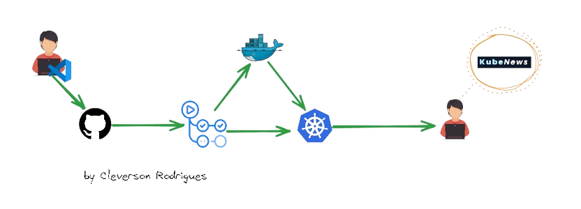

# Kube-News Project

### Objective
The Kube-news project is an application written in NodeJS and aims to be an example application for working with container usage.

### Configuration
To configure the application, it's necessary to have a Postgre database, and to define access to the database, configure the environment variables below:

**DB_DATABASE =>** Name of the database to be used.

**DB_USERNAME =>** Database user password.

**DB_PASSWORD =>** Password of the database user.

**DB_HOST =>** Database address.

### app on:
https://kube.devopslabs.site/

### Diagram of this project

Fork of the application from https://github.com/fabricioveronez/kube-news

\o